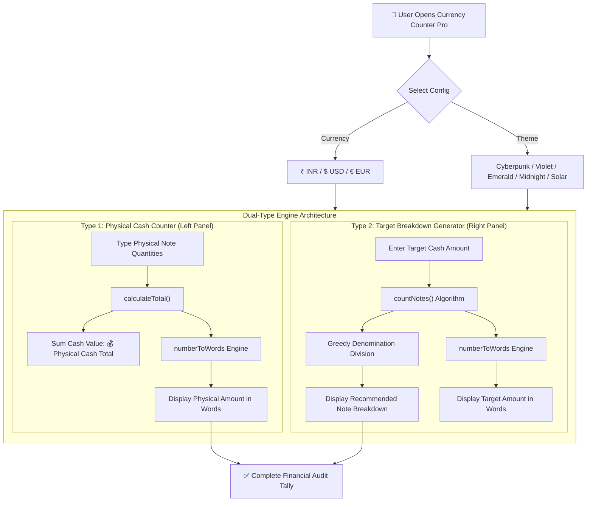

  <h1>💰 Currency Counter Pro — Full-Screen Widescreen Dashboard</h1>

  

    <strong>A world-class, multi-currency cash counter & English amount-in-words breakdown dashboard supporting INR (₹), USD ($), and EUR (€) with zero overflow.</strong>
  

  

    
    
    
    
    
  

## 🌟 Overview

**Currency Counter Pro** is an enterprise-grade, widescreen cash tallying and denomination breakdown web application. Featuring a dual-type 2-panel architecture, high-precision number-to-words algorithm, and 5 curated color themes, it helps retail cashiers, accountants, and business owners count physical currency effortlessly.

---

## 🔄 Application Workflow Chart

---

## ⚡ Core Features

* **🔤 Unrestricted English Amount-in-Words (`numberToWords`):** 
  * Converts any arbitrary large number into full English words in real time without overflow limits.
  * **INR Mode:** Handles Crores, Lakhs, Thousands (e.g., `₹50,905,092,000` ➔ *"Five Thousand Ninety Crore Fifty Lakh Ninety Two Thousand Rupees Only"*).
  * **USD / EUR Mode:** Handles Trillions, Billions, Millions, Thousands (e.g., `$2,500,000` ➔ *"Two Million Five Hundred Thousand Dollars Only"*).
* **🖥️ Dual-Type 2-Panel Architecture:** 
  * **Panel 1 (Type 1):** Physical Cash Counter (Note cards grid for ₹2000, ₹500, ₹200, ₹100, ₹50, ₹20, ₹10, physical cash total & words display).
  * **Panel 2 (Type 2):** Target Breakdown Generator (Target amount input, breakdown target total, target amount words & optimal note distribution list).
* **🎨 5 Curated Color Themes (Theme Switcher):** 
  * 🌌 **Cyberpunk:** Dark Cyan & Electric Blue accents (Default)
  * 🔮 **Neon Violet:** Deep Purple & Magenta accents
  * 🌿 **Emerald Gold:** Emerald Green & Amber Gold accents
  * 🌙 **Midnight Blue:** Deep Sapphire & Electric Navy accents
  * ☀️ **Solar Light:** Crisp Light Mode with Indigo & Slate accents
  * Includes automatic `localStorage` preference persistence.
* **🚫 Zero Vertical Scrollbars:** 
  * Locked 100vh viewport (`overflow: hidden !important`) for a distraction-free dashboard experience.
* **🌍 Multi-Currency Selector:** 
  * Instant toggling between **INR (₹)**, **USD ($)**, and **EUR (€)** note denomination sets.

---

## 🛠️ Technology Stack

| Layer | Technology |
| :--- | :--- |
| **Frontend Layout** | Semantic HTML5 |
| **Styling & UI** | CSS3 Glassmorphism, Google Fonts (`Outfit` & `Fira Code`), Keyframe Animations |
| **Engine** | Vanilla JavaScript ES6+ (Recursive Number-to-Words Parser, Multi-Currency Engine) |
| **Hosting** | GitHub Pages |

---

## 🚀 Live Demo

Access the live application on GitHub Pages:  
🔗 **[https://singh0883.github.io/Count-Currency/](https://singh0883.github.io/Count-Currency/)**

---

## 📬 Author & License

**Yuvraj Singh** — *AI & Data Science Engineer \| Full-Stack Developer*

* 🌐 **GitHub:** [@SINGH0883](https://github.com/SINGH0883)
* 💼 **LinkedIn:** [Yuvraj Singh](https://www.linkedin.com/in/yuvraj-singh-85abc)

Licensed under the [MIT License](LICENSE).
